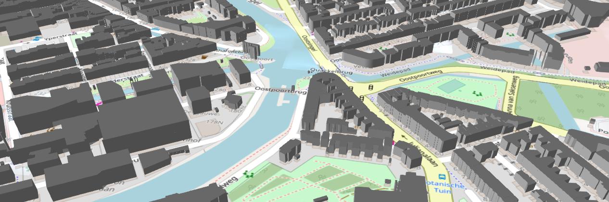
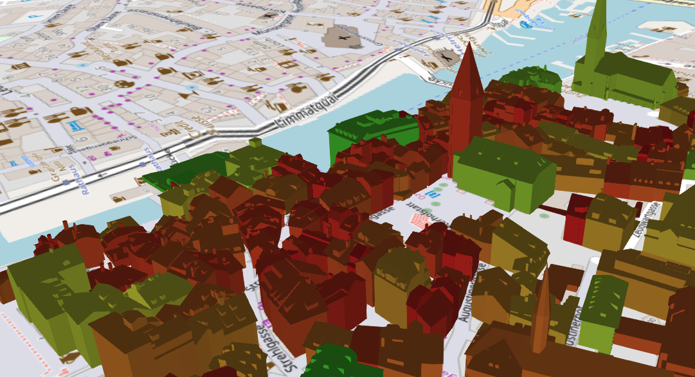

citygml-to-3dtiles
==================

[](https://travis-ci.org/njam/citygml-to-3dtiles)
[](https://www.npmjs.com/package/citygml-to-3dtiles)

A very *basic and experimental* converter from [CityGML](https://www.citygml.org/) to [Cesium 3D Tiles](https://github.com/AnalyticalGraphicsInc/3d-tiles).

About
-----

The purpose of this JavaScript code is to read CityGML files, extract objects (like buildings),
and write the corresponding meshes as a [batched 3D model](https://github.com/AnalyticalGraphicsInc/3d-tiles/blob/master/TileFormats/Batched3DModel/README.md) in the *3D Tiles* spec.
Each building will become a *feature*, and its attributes will be stored in the *3D Tiles batch table*.
For more information see [docs/background.md](docs/background.md). 

The code for writing *3D Tiles* files is based on the [3D Tiles Samples Generator](https://github.com/AnalyticalGraphicsInc/3d-tiles-tools/tree/master/samples-generator).

The functionality is *very* basic, and many **limitations** exist:
- Only city objects of type `Building` are converted.
- Textures are not converted.
- Only a single *B3DM* file is generated. (This works fine for small data sets, for larger sets probably a hierarchy of multiple files with different resolutions should be generated.)
- Files larger than 2GB cannot be converted because of the limits of NodeJS' `Buffer`.

Usage
-----

### CLI Script
The library provides an executable to convert files on the command line.
1. Make sure you have NodeJS version 13+ installed!
```
node --version
```
2. Install the NPM package
```
npm install -g citygml-to-3dtiles
```
3. Use the script to convert CityGML to 3D Tiles
```
citygml-to-3dtiles "my-citygml.xml" "my-output-folder/"
```

When converting large files, it can be necessary to increase NodeJS' memory limit.
For example run the conversion with a 10GB memory limit: 
```
NODE_OPTIONS=--max-old-space-size=10000 citygml-to-3dtiles "my-citygml.xml" "my-output-folder/"
```

Instead of a single input file the script also accepts a path to a folder containing multiple CityGML files.
The contents of all files will get concatenated and written to a single 3D Tileset.

### Programmatic Usage
The library exposes an easy to use API to convert from CityGML to 3D Tiles.
Using the library programmatically allows us to calculate custom *properties* and store them in the resulting tileset.
```js
import Converter from "citygml-to-3dtiles";

let converter = new Converter();
await converter.convertFiles('./input.xml', './output/');
```

#### Option: `propertiesGetter`
By default any CityGML *attributes* and *external references* are stored in the 3D Tiles *batch table*.
Additional properties can be stored per feature by passing `propertiesGetter`.
The function `propertiesGetter` is executed once for each city object and the key/value pairs of the return value will become the model's properties.
The function receives two arguments:
- **cityObject**: An instance of type `CityObject`. Can be used to retrieve the object's geometry and to access the corresponding XML node from the CityGML.
- **properties**: Key/value pairs of all the *attributes* and *external references* from the CityGML. Usually each building will have some kind of identifier assigned to it, which could be used to link the data to other data sets. That way we can blend in other tables of data referencing the same buildings.


Example: Get the value of an element `<measuredHeight>` in the XML namespace "bldg2" (http://www.opengis.net/citygml/building/2.0)
and store it as "measuredHeight" in the batch table:
```js
let converter = new Converter({
  propertiesGetter: (cityObject, properties) => {
    let measuredHeightNode = cityObject.cityNode.selectNode('./bldg2:measuredHeight');
    let measuredHeight = parseFloat(measuredHeightNode.textContent);
    return {
      measuredHeight: measuredHeight
    }
  }
});
await converter.convertFiles('./input.xml', './output/');
```

Example: Store the convex surface area of each building (calculated from the geometry) in the property "surfaceArea":
```js
let converter = new Converter({
  propertiesGetter: (cityObject, properties) => {
    let mesh = cityObject.getTriangleMesh();
    return {
      surfaceArea: mesh.getSurfaceArea()
    }
  }
});
await converter.convertFiles('./input.xml', './output/');
```

#### Option: `objectFilter`
Allows to remove city objects (buildings) based on a callback function.
The function specified receives the city object (`CityObject`) as its only argument and should return `true` or `false` to decide
whether to include it in the 3DTiles output. 

Example: Only include objects with a maximum distance of 600m of a given point.
```js
let center = Cesium.Cartesian3.fromDegrees(8.5177282, 47.3756023);
let converter = new Converter({
  objectFilter: (cityObject) => {
    let distance = Cesium.Cartesian3.distance(center, cityObject.getAnyPoint());
    return distance < 600;
  }
});
await converter.convertFiles('./input.xml', './output/');
```

#### Option: `srsProjections`
The coordinates in CityGML are defined in a certain *spatial reference system* (SRS).
This script assumes that all coordinates in a document are using the *same* SRS.
Height component of coordinates is *not* transformed according to the SRS, because the library used ([proj4js](https://github.com/proj4js/proj4js)) doesn't support it.

Only a few SRS are defined by default. Additional SRS can be passed to the converter:
```
let converter = new Converter({
  srsProjections: {
    'CH1903': '+proj=somerc +lat_0=46.95240555555556 +lon_0=7.439583333333333 +k_0=1 +x_0=600000 +y_0=200000 +ellps=bessel +towgs84=674.374,15.056,405.346,0,0,0,0 +units=m +no_defs',
  }
});
await converter.convertFiles('./input.xml', './output/');
```

The definition should be in the "PROJ.4" format. Definitions in that format can be found at http://epsg.io/.

Examples
--------

For *Delft* an area is available in CityGML2 LOD1 from [TU Delft](https://3d.bk.tudelft.nl/opendata/3dfier/).


For *Zürich* a small area of LOD2 CityGML is available from [Stadt Zürich, Geomatik Vermessung](https://www.stadt-zuerich.ch/ted/de/index/geoz/geodaten_u_plaene/3d_stadtmodell/demodaten.html).
Here the buildings' hull volume is color coded in Cesium:


Development
-----------
Install dependencies:
```
npm install
```

Run tests:
```
npm test
```

Release a new version:
1. Bump version in `package.json`
2. Push a new tag to master
3. The Travis build will deploy to NPM
