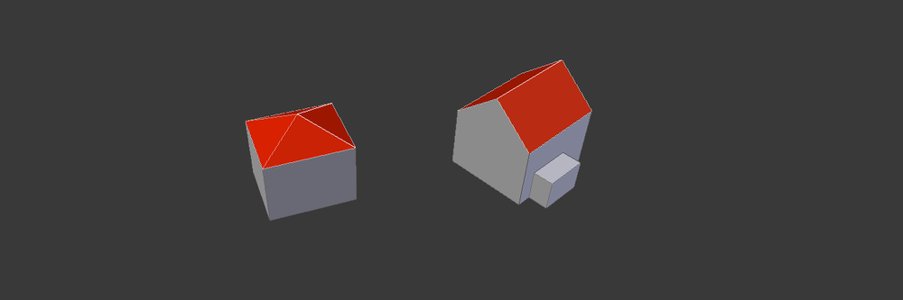
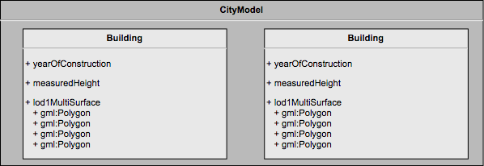
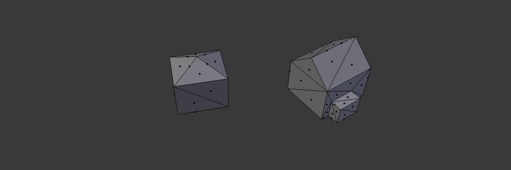

CityGML
-------
[CityGML][citygml] is an XML standard for describing 3D models of cities. It's based on another XML standard called *Geography Markup Language* (GML). Both standards are developed by the standardization consortium OGC.

The basics of CityGML are very intuitive and easy to understand. The document's root node is a `CityModel`, which contains a list of `CityObject`s. These city objects can be of type *Building*, *Bridge*, *Vegetation*, *Tunnel* and a few others. Each city object can have some attributes to describe its characteristics, and will contain some *GML features* to define its geometry.

Imagine two buildings each with walls and a roof:



The corresponding CityGML would contain a single `CityModel` and two `Building`s. Each building could have attributes like "yearOfConstruction" and "measuredHeight" and would contain a so called `lod1MultiSurface`. This entity would contain the necessary GML geometry to define the hull of the buildings, for example a list of polygons.



The raw, simplified XML would look something like this:

```xml
<CityModel>
    <cityObjectMember>
        <bldg:Building>
            <bldg:yearOfConstruction>1940</bldg:yearOfConstruction>
            <bldg:measuredHeight>16.4</bldg:measuredHeight>
            <bldg:lod1MultiSurface>
                <gml:MultiSurface>
                    <gml:surfaceMember>
                        <gml:Polygon>
                            <gml:exterior>
                                <gml:LinearRing srsName="CH1903" srsDimension="3">
                                    <gml:pos>683278.754 247335.818 409.3</gml:pos>
                                    <gml:pos>683286.378 247338.829 409.3</gml:pos>
                                    <gml:pos>683286.378 247338.829 425.7</gml:pos>
                                    <gml:pos>683278.754 247335.818 425.7</gml:pos>
                                    <gml:pos>683278.754 247335.818 409.3</gml:pos>
                                </gml:LinearRing>
                            </gml:exterior>
                        </gml:Polygon>
                    </gml:surfaceMember>
                    [...]
                </gml:MultiSurface>
            </bldg:lod1MultiSurface>
        </bldg:Building>
    </cityObjectMember>

    <cityObjectMember>
        <bldg:Building>[...]</bldg:Building>
    </cityObjectMember>
</CityModel>
```

The polygons defining the walls of the buildings contain a bunch of 3D coordinates (`gml:pos`). Each coordinate consists of three numbers: longitude, latitude and height. The coordinates are expressed in a specific coordinate-system (*spatial reference system* SRS), in this case the Swiss coordinate system "CH1903" as is defined with the attribute `srsName="CH1903"`.

The commonly used coordinate system is "WGS84". The same polygon expressed as coordinates in WGS84 would look like this:

```xml
<gml:LinearRing srsName="WGS84" srsDimension="3">
    <gml:pos>8.541258 47.3715983 409.3</gml:pos>
    <gml:pos>8.5413594 47.3716244 409.3</gml:pos>
    <gml:pos>8.5413594 47.3716244 425.7</gml:pos>
    <gml:pos>8.541258 47.3715983 425.7</gml:pos>
    <gml:pos>8.541258 47.3715983 409.3</gml:pos>
</gml:LinearRing>
```

CityGML gives us a way to describe a set of buildings (and other *city objects*) and the exact geometric shape of their walls and other exterior parts.


3D Tiles
--------
[3D Tiles][3d-tiles] is a specification from Cesium to stream and render 3D meshes. One of its use cases is to progressively load 3D buildings on a map, when zooming in.

A 3D Tiles dataset is described in a file called `tileset.json`. This file defines the area for which it contains data (longitude, latitude and height) and a URL where that data can be loaded:

```json
{
  "root": {
    "boundingVolume": {
      "region": [
        0.14900111790831405, 0.8267774614090546,
        0.14908570176240377, 0.8267920546921999,
        409.3, 425.7
      ]
    },
    "content": {
      "url": "buildings.b3dm"
    }
  }
}
```
The tileset metadata file can also define how to load higher-resolution data for the same region when the client zooms in. But for our purpose we'll ignore that functionality and stick with the bare basics.

Our data URL references a file called `buildings.b3dm` which is a file in the *Batched 3D Model* format. This file contains the raw data to render all models in our scene in the [GL transmission format (glTF)][gltf].
The two houses from before would be declared and rendered as 36 triangles. Each vertex of each triangle will have a numeric identifier to indicate which model it belongs to ("batchId").



The B3DM file also contains a so called *Batch Table*, which stores custom properties for the models in the scene. For our two buildings that could look like this:

```json
{
  "id": [1, 2],
  "yearOfConstruction": [1940, 1902],
  "measuredHeight": [16.4, 20.3]
}
```

Together these two pieces of information (models' geometry and models' properties) allow to render buildings and to visualize the values of properties in different ways.


[citygml]: https://www.citygml.org/
[3d-tiles]: https://github.com/AnalyticalGraphicsInc/3d-tiles
[gltf]: https://www.khronos.org/gltf/
